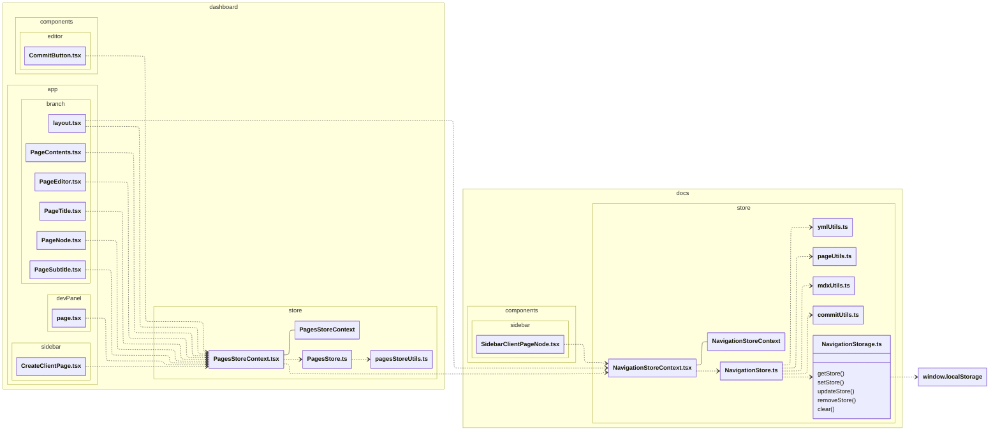

# fern-platform/packages/fern-dashboard

## PagesStore and NavigationStore

```mermaid
---
config:
  layout: elk
  class:
    hideEmptyMembersBox: true
---
classDiagram
direction LR
	namespace dashboard.app.branch {
        class layout.tsx {
        }
        class PageContents.tsx {
        }
        class PageEditor.tsx {
        }
        class PageNode.tsx {
        }
        class PageSubtitle.tsx {
        }
        class PageTitle.tsx {
        }
	}
	namespace dashboard.app.devPanel {
        class page.tsx {
        }
        }
	namespace dashboard.app.sidebar {
        class CreateClientPage.tsx {
        }
	}
	namespace docs.components.sidebar {
        class SidebarClientPageNode.tsx {
        }
	}
	namespace dashboard.store {
        class PagesStoreContext.tsx {
        }
        class PagesStoreContext {
        }
        class PagesStore.ts {
        }
        class pagesStoreUtils.ts {
        }
	}
        namespace dashboard.components.editor {
        class CommitButton.tsx {
        }
	}
	namespace docs.store {
        class NavigationStoreContext.tsx {
        }
        class NavigationStoreContext {
        }
        class NavigationStore.ts {
        }
        class NavigationStorage.ts {
	        getStore()
	        setStore()
                updateStore()
	        removeStore()
	        clear()
        }
        class commitUtils.ts {
        }
        class mdxUtils.ts {
        }
        class pageUtils.ts {
        }
        class ymlUtils.ts {
        }
	}
    class window.localStorage {
    }

    layout.tsx ..> PagesStoreContext.tsx
    layout.tsx ..> NavigationStoreContext.tsx
    PageContents.tsx ..> PagesStoreContext.tsx
    PageEditor.tsx ..> PagesStoreContext.tsx
    PageNode.tsx ..> PagesStoreContext.tsx
    PageSubtitle.tsx ..> PagesStoreContext.tsx
    PageTitle.tsx ..> PagesStoreContext.tsx
    CommitButton.tsx ..> PagesStoreContext.tsx
    page.tsx ..> PagesStoreContext.tsx
    CreateClientPage.tsx ..> PagesStoreContext.tsx
    SidebarClientPageNode.tsx ..> NavigationStoreContext.tsx
    PagesStoreContext.tsx ..> NavigationStoreContext.tsx
    PagesStoreContext.tsx -- PagesStoreContext
    PagesStoreContext.tsx ..> PagesStore.ts
    PagesStore.ts ..> pagesStoreUtils.ts
    NavigationStoreContext.tsx -- NavigationStoreContext
    NavigationStoreContext.tsx ..> NavigationStore.ts
    NavigationStore.ts ..> NavigationStorage.ts
    NavigationStore.ts ..> commitUtils.ts
    NavigationStore.ts ..> mdxUtils.ts
    NavigationStore.ts ..> pageUtils.ts
    NavigationStore.ts ..> ymlUtils.ts
    NavigationStorage.ts ..> window.localStorage
```
